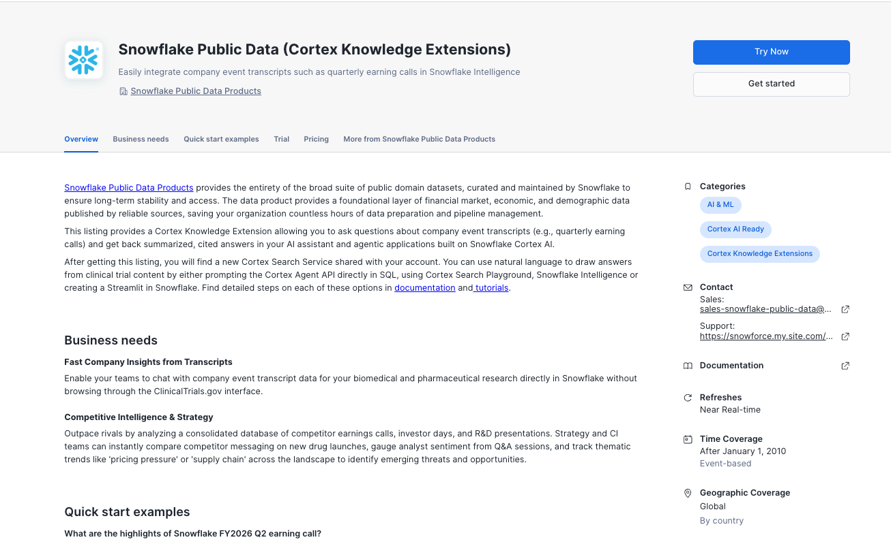

# ![][image1]

# Mini Workshop with Snowflake

The purpose of the workshop is to gain insight into how the process of creating AI agents in Snowflake Intelligence related to Investment analysis.   
For any follow up questions please feel free to reach out to your Snowflake team; [Leif Engdell](mailto:leif.engdell@snowflake.com)

## Creating a Snowflake Account

Creating the trial account can be done through [signup.snowflake.com](http://signup.snowflake.com) 

You need to choose a region and edition of Snowflake (I recommend you choose Business Critical edition or Enterprise edition) and secure the account with Multifactor Authentication. 

Since this is a trial account you should not put any proprietary or confidential information into this account. 

## Getting Public data 

There are several ways you can use public unstructured data with Snowflake, during the workshop we will look at two ways:

- Trial of Snowflake Public Data, and
- Snowflake Public Data (Cortex Knowdled Extensions)

### [Snowflake Public Data (Paid)](https://app.snowflake.com/marketplace/listing/GZTSZ290BUXPL/snowflake-public-data-products-snowflake-public-data-paid?search=snowflake)

### [Snowflake Cortex Knowledge Extensions](https://app.snowflake.com/marketplace/listing/GZTSZ290BV65X/snowflake-public-data-products-snowflake-public-data-cortex-knowledge-extensions)

This listing provides a Cortex Knowledge Extension allowing you to ask questions about company event transcripts (e.g., quarterly earning calls) and get back summarized, cited answers in your AI assistant and agentic applications built on Snowflake Cortex AI.

## Setting up Workshop

See [README.md](./README.md).

### Issues

#### Jinja issues with .AI in CKE

Found the issue! The .AI. in the schema name SNOWFLAKE_PUBLIC_DATA_CORTEX_KNOWLEDGE_EXTENSIONS.AI.COMPANY_EVENT_TRANSCRIPT_CORTEX_SEARCH_SERVICE is being interpreted by Snow CLI's templating engine as a Jinja variable reference (.AI triggers the template parser).

This is a Snow CLI limitation when dealing with database object names containing .AI. patterns. The agent script must be executed via Snowflake UI when it includes the Company Event Transcript search service.